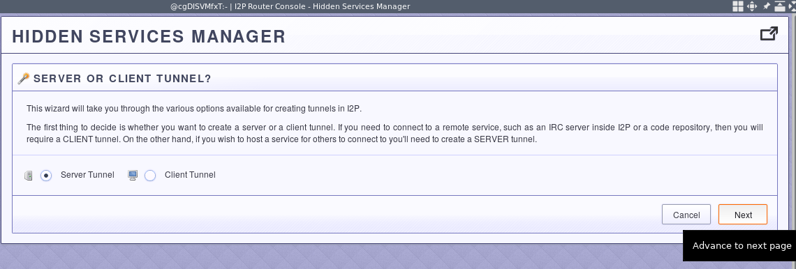
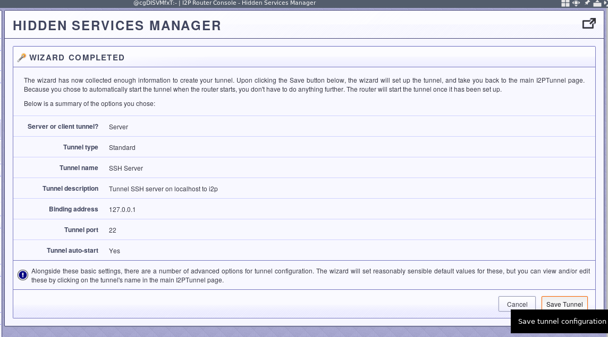

How to set up an ssh server behind i2p for personal access
==========================================================

This is a tutorial on how to set up and tweak an i2p tunnel in order to use it
to access an SSH server remotely, using either i2p or i2pd. For now, it assumes
you will install your SSH server from a package manager and that it's running
as a service.

Considerations: In this guide, I'm assuming a few things. They will need to be
adjusted depending on the complications that arise in your particular setup,
especially if you use VM's or containers for isolation. This assumes that the
i2p router and the ssh server are running on the same localhost.

Step One: Set up i2p tunnel for SSH Server
------------------------------------------

### Using Java i2p

Using java i2p's web interface, navigate to the (Links to your Router Console)[Hidden Services Manager](http://127.0.0.1:7657/i2ptunnelmgr)
and start the tunnel wizard.

#### Tunnel Wizard

Since you are setting up this tunnel for the SSH server, you need to select the
"Server" tunnel type.



You should fine-tune it later, but the Standard tunnel type is easiest to start
with.


Give it a good description:


And tell it where the SSH server will be available.


Look over the results, and save your settings.



#### Advanced Settings

Now head back over the the Hidden Services Manager, and look over the available
advanced settings. One thing you'll definitely want to change is to set it up
for interactive connections intstead of bulk connections.


Besides that, these other options can affect performance when accessing your SSH
server. If you aren't that concerned about your anonymity, then you could reduce
the number of hops you take. If you have trouble with speed, a higher tunnel
count might help. A few backup tunnels are probably a good idea. You might have
to dial-it-in a bit.


Finally, restart the tunnel so that all of your settings take effect.

### Using i2pd

With i2pd, all configuration is done with files instead of via a web interface.
In order to configure an SSH Service tunnel for i2pd, tweak the following
example settings to your anonymity and performance needs and copy them into
tunnels.conf

```
[SSH-SERVER]
type = server
port = 22
inbound.length = 1
outbound.length = 1
inbound.quantity = 5
outbound.quantity = 5
inbound.backupQuantity = 2
outbound.backupQuantity = 2
```

### Restart your i2p router

Step Two: Set up SSH server
---------------------------

Depending on how you want to access your SSH Server, you may want to make a few
changes to the settings. Besides the obvious SSH hardening stuff you should do
on all SSH servers(Public-Key Authentication, no login as root, etc), if you
don't want your SSH server to listen on any addresses except your server tunnel,
you should change AddressFamily to inet and ListenAddress to 127.0.0.1.

```
AddressFamily inet
ListenAddress 127.0.0.1
```

If you choose to use a port other than 22 for your SSH server, you will need to
change the port in your i2p tunnel configuration.

Step Three: Set up i2p tunnel for SSH Client
--------------------------------------------

On the computer where you will be connecting, you will need to set up a client
tunnel

Step Four: Set up SSH client
----------------------------

