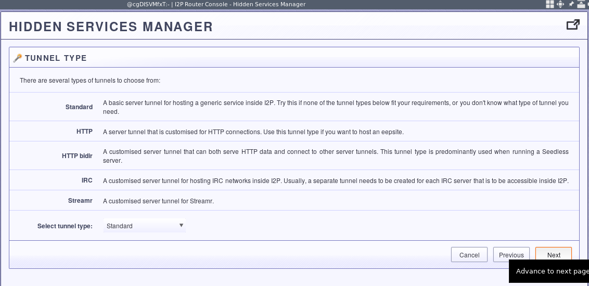
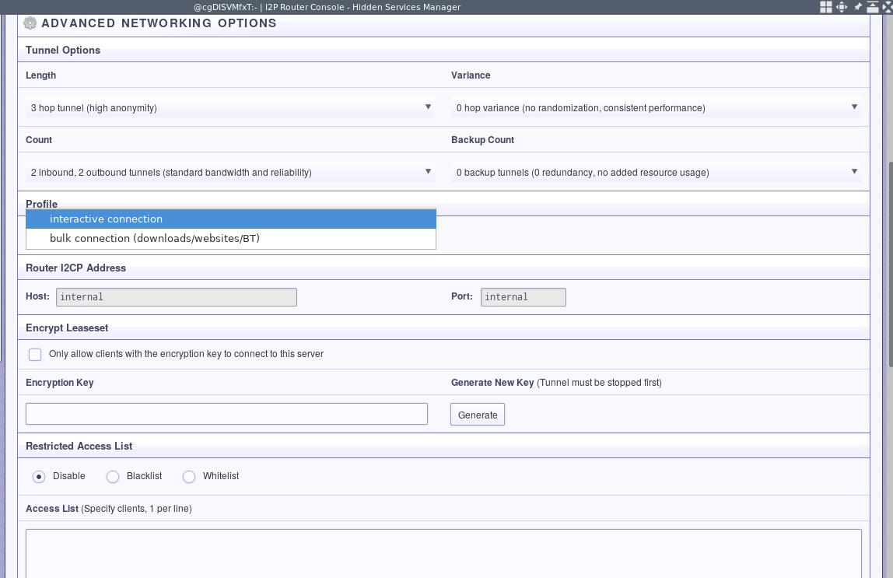

How to set up an ssh server behind i2p for personal access
==========================================================

Considerations: In this guide, we're assuming a few things. They will need to be
adjusted depending on the complications that arise in your particular setup,
especially if you use VM's or containers for isolation. This assumes that the
i2p router and the ssh server are running on the same localhost.

Step One: Set up i2p tunnel for SSH Server
----------------------------

### Using Java i2p

#### Tunnel Wizard

#### Advanced Settings

### Using i2pd

Step Two: Set up SSH server
---------------------------

Step Three: Start i2p tunnels and SSH server
--------------------------------------------

Step Four: Set up i2p tunnel for SSH Client
--------------------------------------------

Step Five: Set up SSH client
----------------------------

Step Six: Start i2p tunnel for SSH Client
-----------------------------------------
# i2p-i2pd-sshsetup
